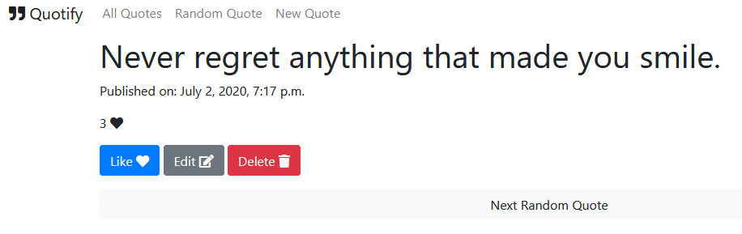

# Quotify: Your Daily Dose of Inspirational Quotes (A Django Example App)



An example app using Django, SQLite, and Bootstrap. Deployed on heroku: https://django-quotify.herokuapp.com/

Quotify allows you to see random inspirational quotes, add new ones, edit or delete existing ones.

## Setup

```
pip install -r requirements.txt
```

## Usage

```
python manage.py runserver
```

Then go to http://127.0.0.1:8000

## Development

* `quotify` is the Django project
* `quotes` is the app

See my [django_tutorial repo](https://github.com/stefanbschneider/django_tutorial) for another example app + useful commands,
based on the Django tutorial.

## Deployment

* Deployment on heroku
* Configure heroku config vars:
    * `DJANGO_SETTINGS_MODULE = quotify.prod_settings`
    * `DJANGO_SECRET_KEY = <secret key>`
